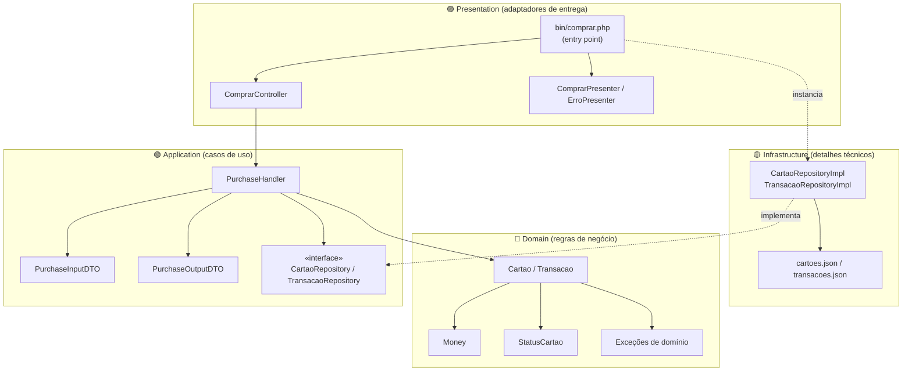
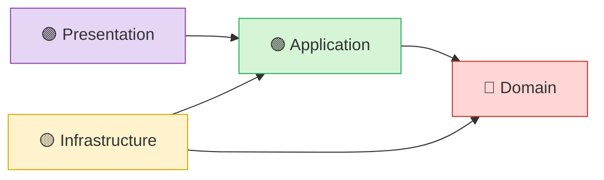
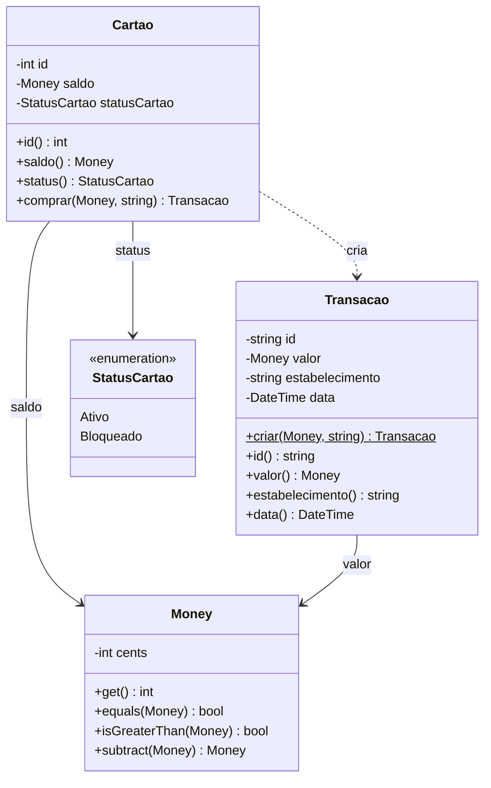
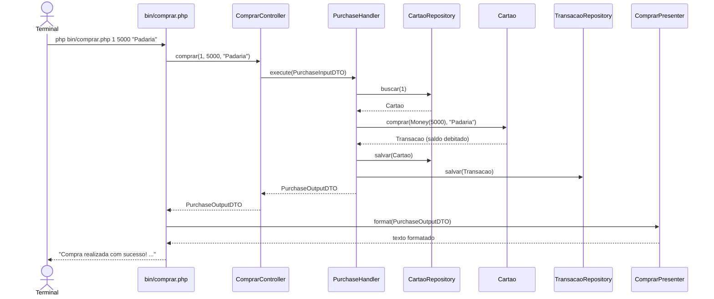
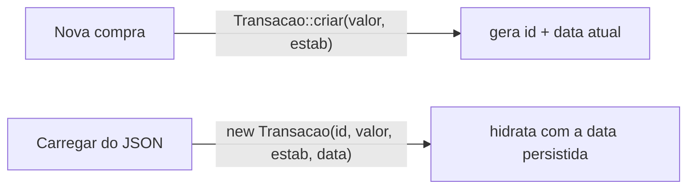

# 💳 Cartão de Benefícios

Aplicação de exemplo que implementa um fluxo de **compra com cartão de benefícios**
seguindo os princípios da **Clean Architecture** (Arquitetura Limpa) e de
**Domain-Driven Design (DDD)** em PHP 8.2.

O projeto é didático: cada camada tem responsabilidades bem definidas, as
dependências apontam sempre para o centro (o domínio), e a regra de negócio é
totalmente independente de frameworks, banco de dados e interface.

---

## 📑 Índice

- [Visão geral](#-visão-geral)
- [A Arquitetura Limpa neste projeto](#-a-arquitetura-limpa-neste-projeto)
- [Direção das dependências](#-direção-das-dependências)
- [Estrutura de diretórios](#-estrutura-de-diretórios)
- [O modelo de domínio](#-o-modelo-de-domínio)
- [Fluxo de uma compra](#-fluxo-de-uma-compra)
- [Persistência](#-persistência)
- [Como executar](#-como-executar)
- [Testes](#-testes)
- [Decisões de design e lições](#-decisões-de-design-e-lições)
- [Tecnologias](#-tecnologias)

---

## 🔭 Visão geral

O caso de uso central é **comprar** com um cartão. A operação:

1. Recupera o cartão pelo identificador.
2. Valida o valor da compra, o saldo e o status do cartão.
3. Debita o saldo e gera uma **transação**.
4. Persiste o cartão atualizado e a transação.
5. Devolve um resultado formatado para o usuário.

Tudo isso é acionado por um **adaptador de linha de comando (CLI)**:

```bash
php bin/comprar.php <cartaoId> <valorEmCentavos> <estabelecimento>
```

```text
Compra realizada com sucesso!
Transacao:     4341b7e4-cbeb-42ab-9937-57898bd65d37
Estabelecimento: Padaria Central
Data:          30/06/2026 15:09:29
Saldo restante: R$ 270,00
```

---

## 🧅 A Arquitetura Limpa neste projeto

A aplicação é organizada em quatro camadas concêntricas. Quanto mais ao centro,
mais estável e mais livre de detalhes externos o código é.



| Camada | Responsabilidade | Exemplos |
|--------|------------------|----------|
| **Domain** 🔴 | Regras de negócio puras. Não conhece ninguém. | `Cartao`, `Transacao`, `Money`, `StatusCartao`, exceções de domínio |
| **Application** 🟢 | Orquestra casos de uso e define contratos (portas). | `PurchaseHandler`, DTOs, interfaces `*Repository` |
| **Infrastructure** 🟡 | Implementa os contratos com detalhes técnicos. | `*RepositoryImpl`, persistência em JSON |
| **Presentation** 🟣 | Adapta entrada e saída para o mundo externo. | `ComprarController`, presenters, `bin/comprar.php` |

---

## ➡️ Direção das dependências

A regra de ouro da Clean Architecture: **as dependências sempre apontam para
dentro**. O domínio não sabe que existe banco, JSON ou terminal. A inversão de
dependência (via interfaces) é o que permite isso.



> A `Infrastructure` **implementa** interfaces definidas na `Application`
> (`CartaoRepository`, `TransacaoRepository`). Assim, a camada de fora depende da
> de dentro — e não o contrário.

---

## 🗂️ Estrutura de diretórios

```text
.
├── bin/
│   └── comprar.php                 # Entry point CLI (wiring + leitura de argumentos)
├── src/
│   ├── Domain/                     # 🔴 Regras de negócio
│   │   ├── Entities/
│   │   │   ├── Cartao.php
│   │   │   └── Transacao.php
│   │   ├── ValueObjects/
│   │   │   └── Money.php
│   │   ├── Enums/
│   │   │   └── StatusCartao.php
│   │   └── Exceptions/
│   │       ├── CartaoBloqueadoException.php
│   │       ├── CartaoBloqueadoParaOperacaoException.php
│   │       ├── EstabelecimentoInvalidoException.php
│   │       ├── InvalidCompraValueException.php
│   │       ├── InvalidMoneyValueException.php
│   │       └── SaldoInsuficienteException.php
│   ├── Application/                # 🟢 Casos de uso
│   │   ├── UseCases/
│   │   │   └── PurchaseHandler.php
│   │   ├── DTOs/
│   │   │   ├── PurchaseInputDTO.php
│   │   │   └── PurchaseOutputDTO.php
│   │   └── Ports/
│   │       └── Output/
│   │           ├── CartaoRepository.php       # «interface»
│   │           └── TransacaoRepository.php    # «interface»
│   ├── Infrastructure/             # 🟡 Detalhes técnicos
│   │   ├── Repositories/
│   │   │   ├── CartaoRepositoryImpl.php
│   │   │   └── TransacaoRepositoryImpl.php
│   │   ├── Persistence/
│   │   │   ├── cartoes.json
│   │   │   └── transacoes.json
│   │   └── Exceptions/
│   │       ├── CartaoNaoEncontradoException.php
│   │       ├── InvalidCartoesPersistenceException.php
│   │       ├── InvalidTransacoesPersistenceException.php
│   │       ├── PersistenceFileNotFoundException.php
│   │       └── TransacaoNaoEncontradaException.php
│   └── Presentation/               # 🟣 Adaptadores de entrega
│       ├── Console/
│       │   └── ComprarController.php
│       └── Presenters/
│           ├── ComprarPresenter.php
│           └── ErroPresenter.php
├── tests/                          # Suíte de testes (Pest)
│   └── Unit/
│       ├── Domain/...
│       ├── Application/...
│       └── Presentation/...
├── composer.json
└── phpunit.xml
```

> O namespace raiz é `Tavares\CartaoDeBeneficios\`, mapeado para `src/` via
> autoload PSR-4. Os testes usam o namespace `Tests\`, mapeado para `tests/`
> via `autoload-dev`.

---

## 🧩 O modelo de domínio



### Invariantes principais

- **`Money`** representa um valor monetário em **centavos** e é **não-negativo**
  (`>= 0`). Negativo lança `InvalidMoneyValueException`. É **imutável**: operações
  como `subtract()` retornam uma nova instância.
- **`Cartao.comprar()`** valida, nesta ordem: valor da compra `> 0`, saldo
  suficiente e cartão não bloqueado. Em seguida debita o saldo e cria a transação.
- **`Transacao`** distingue **criação** de **reconstituição** (veja
  [Decisões de design](#-decisões-de-design-e-lições)).

---

## 🔄 Fluxo de uma compra



Em caso de erro (saldo insuficiente, cartão bloqueado, valor inválido), o
entry point captura a exceção e a entrega ao **`ErroPresenter`**, que devolve a
mensagem formatada — e o processo encerra com código de saída `1`.

---

## 💾 Persistência

A persistência é feita em arquivos **JSON** simples, isolada na camada de
infraestrutura. Os repositórios implementam as interfaces da `Application`.

`cartoes.json`:

```json
{
  "cartoes": [
    { "id": 1, "saldo": 50000, "statusCartao": "A" }
  ]
}
```

`transacoes.json`:

```json
{
  "transacoes": [
    {
      "id": "f47ac10b-58cc-4372-a567-0e02b2c3d479",
      "valor": 15000,
      "estabelecimento": "Padaria Central",
      "data": "2026-06-29T14:30:45"
    }
  ]
}
```

> `statusCartao` usa os valores do enum `StatusCartao`: `"A"` (Ativo) e
> `"B"` (Bloqueado). Os valores monetários são sempre em **centavos**.

---

## 🚀 Como executar

### Pré-requisitos

- PHP 8.2+
- [Composer](https://getcomposer.org/)

### Instalação

```bash
composer install
```

### Executando uma compra

```bash
php bin/comprar.php <cartaoId> <valorEmCentavos> <estabelecimento>
```

Exemplo:

```bash
php bin/comprar.php 1 5000 "Padaria Central"
```

| Argumento | Descrição | Exemplo |
|-----------|-----------|---------|
| `cartaoId` | Identificador do cartão | `1` |
| `valorEmCentavos` | Valor da compra em centavos | `5000` (= R$ 50,00) |
| `estabelecimento` | Nome do estabelecimento | `"Padaria Central"` |

---

## 🧪 Testes

A suíte de testes usa o **[Pest](https://pestphp.com/)** e cobre todas as
classes com comportamento (domínio, casos de uso e apresentação).

```bash
./vendor/bin/pest
```

```text
Tests:    27 passed (52 assertions)
```

A inversão de dependência permite testar o caso de uso **`PurchaseHandler`** com
**repositórios falsos (fakes) em memória**, sem tocar em nenhum arquivo JSON —
exatamente o benefício que a arquitetura proporciona.

---

## 🧠 Decisões de design e lições

### Value Object imutável (`Money`)

Dinheiro é modelado como um **Value Object** em centavos (evita imprecisão de
ponto flutuante) e imutável. A regra "não-negativo" pertence ao próprio tipo;
a regra "compra deve ser maior que zero" pertence à operação de compra, não ao
dinheiro.

### Portas e adaptadores (Ports & Adapters)

A `Application` define **interfaces** (`CartaoRepository`,
`TransacaoRepository`) e a `Infrastructure` as implementa. O caso de uso
depende da abstração, nunca da implementação concreta — o que torna o sistema
testável e independente do mecanismo de persistência.

### Criação vs. Reconstituição

A entidade `Transacao` separa explicitamente dois caminhos:



- **`Transacao::criar(...)`** → caminho de **criação**: gera o `id` (UUID) e
  carimba a data **atual**.
- **`new Transacao(...)`** → caminho de **reconstituição**: hidrata uma transação
  já existente, aceitando **qualquer data** (inclusive passada).

Isso evita que uma invariante de criação (ex.: "a data é hoje") impeça
reconstruir uma transação antiga vinda da persistência — pré-requisito, por
exemplo, para um futuro caso de uso de **estorno**.

### Controller e Presenter como espelhos

O **`ComprarController`** adapta a **entrada** (dados crus → DTO) e o
**`ComprarPresenter`** adapta a **saída** (DTO → texto). O entry point fica
"magro": faz o wiring, lê os argumentos e delega — sem regra de negócio nem
formatação.

---

## 🛠️ Tecnologias

- **PHP 8.2** — enums, `readonly`, constructor property promotion
- **Composer** — autoload PSR-4
- **[ramsey/uuid](https://github.com/ramsey/uuid)** — geração de identificadores únicos (UUID v4)
- **[Pest](https://pestphp.com/)** — framework de testes

---

> Projeto desenvolvido por **Rodrigo Tavares Ferreira** como estudo prático de
> Clean Architecture e DDD em PHP.
